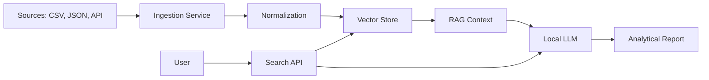

# EventHorizon

Local Knowledge & Event Analysis Platform for algorithmic trading systems.

## Overview
EventHorizon is a lightweight, production-ready framework designed to store, index, and semantically search through events and documents across multiple domains. Built with Python 3.11+, FastAPI, and txtai, it provides:

- **Semantic Search**: Find similar events by meaning, not keywords
- **Data Ingestion**: API endpoint for structured event storage
- **Local Execution**: No external dependencies or cloud services required
- **Modular Architecture**: Easy to extend for any domain (trading, research, logs, etc.)

## Features
- FastAPI REST API with Swagger UI documentation
- txtai-powered vector database for semantic search
- Pydantic v2 for data validation and schemas
- Windows-compatible (tested on Windows 11)
- Production-grade logging and error handling
- Docker-ready with compose file

## Quick Start
1. Clone repository
2. Create virtual environment: `python -m venv .venv`
3. Activate: `.venv\Scripts\Activate.ps1`
4. Install dependencies: `pip install -r requirements.txt`
5. Start server: `python -m src.api.main`
6. Open Swagger: `http://127.0.0.1:8000/docs`

## API Endpoints
- `POST /ingest/` - Add new event to knowledge base
- `POST /search/` - Semantic search for similar events
- `GET /health` - Health check endpoint

## Use Cases
- Algorithmic trading event analysis
- Research paper indexing
- Log analysis and pattern detection
- News monitoring and trend analysis

## Architecture

## License
MIT License - see LICENSE file for details

