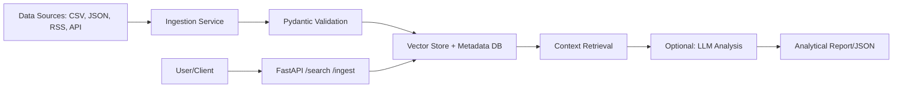

# EventHorizon

**Production-grade Local Knowledge & Event Analysis Platform**

A lightweight, modular framework for semantic storage, indexing, and retrieval of structured events and documents. Built with Python 3.11+, FastAPI, and designed for local deployment without cloud dependencies.

---

## ✅ Overview

EventHorizon provides a clean, extensible architecture for:
- **Semantic event storage** with structured metadata
- **Fast vector-based search** across historical data
- **Domain-agnostic design** (trading, research, logs, compliance)
- **Production-ready API** with validation, logging, and health checks
- **Docker containerization** for reproducible deployments

Originally designed for algorithmic trading event analysis, EventHorizon abstracts domain logic into configurable schemas—making it suitable for any use case requiring **time-series event analysis with semantic context**.

---

## ✨ Key Features

- 🚀 **FastAPI REST API** with auto-generated Swagger UI
- 🔍 **Semantic search** (vector embeddings + metadata filtering)
- 🗃️ **Pydantic v2 schemas** for strict data validation
- 🐳 **Docker Compose** setup for API + UI services
- ⚙️ **CI/CD pipeline** with GitHub Actions (pytest + linting)
- 🗂‍⚙️ **Persistent storage** (SQLite default, extensible to PostgreSQL/other)
- 🔍 **Windows 11 compatible** (tested on HP Pavilion Gaming, i5-10300H, 16GB RAM)

---

## 🛠️ Architecture



**Core Components:**
1. **API Layer** (`src/api/main.py`): FastAPI endpoints for ingestion & search
2. **Knowledge Engine** (`src/knowledge/engine.py`): Vector indexing & retrieval logic
3. **Data Models** (`src/models.py`): Pydantic schemas for events & queries
4. **UI Layer** (`ui/streamlit_app.py`): Streamlit dashboard for visualization (optional)

---

## ⬆️ Quick Start

### Prerequisites
- Python 3.11+
- Docker Desktop (optional, for containerized setup)
- Git

### Local Installation (without Docker)

1. **Clone repository:**
   ```powershell
   git clone https://github.com/russo2100/EventHorizon.git
   cd EventHorizon
   ```

2. **Create virtual environment:**
   ```powershell
   python -m venv .venv
   .venv\Scripts\Activate.ps1
   ```

3. **Install dependencies:**
   ```powershell
   pip install -r requirements.app.txt
   ```

4. **Run API server:**
   ```powershell
   python -m src.api.main
   ```

5. **Open Swagger UI:**
   ```
   http://127.0.0.1:8000/docs
   ```

### Docker Setup (recommended for production)

1. **Build and start services:**
   ```powershell
   docker compose up --build
   ```

2. **Access services:**
   - API: `http://localhost:8000/docs`
   - UI (Streamlit): `http://localhost:8501`

3. **Stop services:**
   ```powershell
   docker compose down
   ```

---

## 📡 API Endpoints

| Endpoint | Method | Description |
|----------|--------|-------------|
| `/health` | GET | Health check (returns system status) |
| `/ingest/` | POST | Add structured event to knowledge base |
| `/search/` | POST | Semantic search with filters (top-K results) |

### Example: Ingest Event

```bash
curl -X POST "http://localhost:8000/ingest/" \
  -H "Content-Type: application/json" \
  -d '{
    "timestamp": "2026-01-17T16:00:00Z",
    "source": "EIA Weekly Report",
    "text": "Natural gas storage decreased by 150 Bcf",
    "metadata": {"sector": "energy", "impact": "bullish"}
  }'
```

### Example: Search Events

```bash
curl -X POST "http://localhost:8000/search/" \
  -H "Content-Type: application/json" \
  -d '{
    "query": "storage surprise impact on prices",
    "top_k": 5
  }'
```

---

## ⚙️ Testing & CI/CD

### Run tests locally:
```powershell
pytest tests/ -v
```

### GitHub Actions workflow:
- Automatically runs on push/PR to `main`
- Lints code with `flake8`
- Runs `pytest` test suite
- Status badge: 

---

## 📁 Project Structure

```
EventHorizon/
├── src/
│   ├── api/
│   │   └── main.py           # FastAPI app entry point
│   ├── knowledge/
│   │   └── engine.py         # Vector search & indexing logic
│   └── models.py             # Pydantic schemas
├── ui/
│   └── streamlit_app.py      # Optional UI dashboard
├── tests/
│   └── test_api.py           # API integration tests
├── .github/
│   └── workflows/
│       └── tests.yml         # CI/CD pipeline config
├── docker-compose.yml        # Multi-service orchestration
├── Dockerfile                # API service container
├── requirements.app.txt      # Production dependencies
├── .gitignore
├── LICENSE
└── README.md
```

---

## 🎯 Use Cases

- **Algorithmic Trading:** Store market events (news, storage reports, weather) and retrieve historical patterns for decision logic
- **Research & Academia:** Index papers/documents with semantic search for literature review
- **Compliance & Audit:** Log structured events with timestamps and search by context
- **DevOps & Monitoring:** Aggregate logs and detect similar incidents via semantic similarity

---

## ⚙️ Configuration

### Environment Variables (optional)

Create `.env` file (see `.env.example`):
```env
API_HOST=0.0.0.0
API_PORT=8000
LOG_LEVEL=INFO
```

### Customizing Data Schema

Edit `src/models.py` to add domain-specific fields:
```python
from pydantic import BaseModel, Field, ConfigDict
from typing import List, Optional, Dict, Any
from datetime import datetime

class EventBase(BaseModel):
    model_config = ConfigDict(populate_by_name=True)
    source: str = Field(..., description="Event source")
    content: str = Field(..., description="Main content/text")
    timestamp: datetime = Field(default_factory=datetime.now)
    tags: List[str] = Field(default_factory=list)
    metadata: Dict[str, Any] = Field(default_factory=dict, description="Additional metadata as JSON")
```

---

## 💙 Contributing

1. Fork the repository
2. Create feature branch: `git checkout -b feature/my-feature`
3. Commit changes: `git commit -m "Add my feature"`
4. Push to branch: `git push origin feature/my-feature`
5. Open Pull Request

**Coding standards:**
- Follow PEP 8 (checked by `flake8`)
- Write tests for new features
- Update README if adding major functionality

---

## 🗄️ License

MIT License - see [LICENSE](LICENSE) file for details.

---

## 🗺️ Roadmap

- [ ] Add PostgreSQL support for large-scale deployments
- [ ] Integrate LLM-based summarization for retrieved events
- [ ] Add Prometheus metrics for monitoring
- [ ] Multi-language support for semantic search
- [ ] Web-based admin panel for knowledge base management

---

**Built with ❤️ for production-grade local AI systems**
